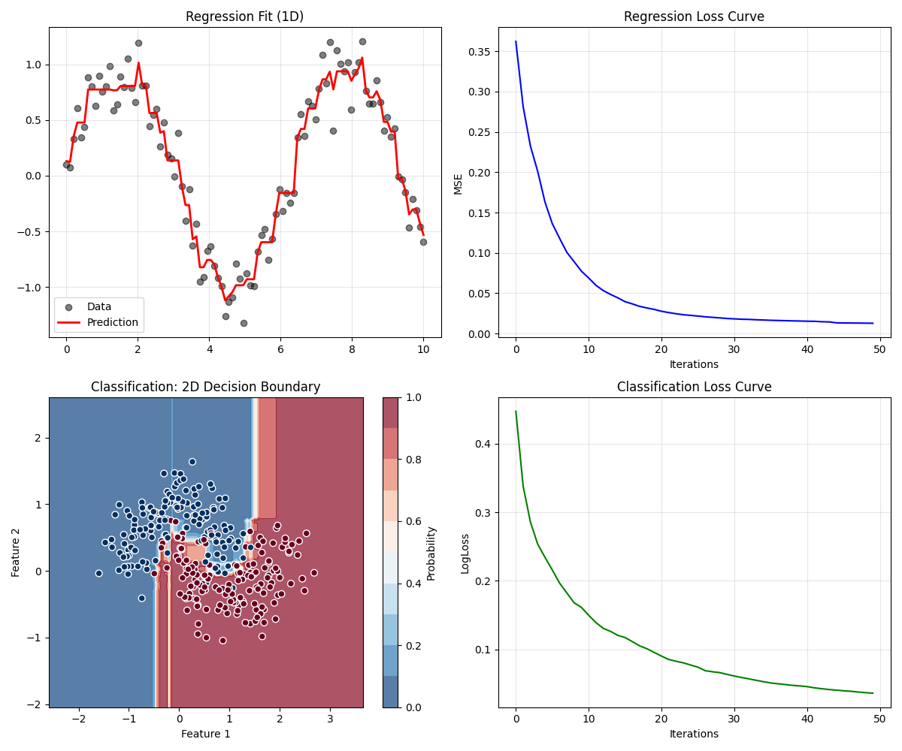

# GradientStuff

**GradientStuff** is a lightweight, educational implementation of **Gradient Boosting** from scratch in Python. It is designed to be easy to read and understand, making it a perfect resource for learning how gradient boosting machines (GBMs) work under the hood.


*Figure 1 — High-level illustration of gradient boosting training and prediction flow.*

---

## 🚀 Features

- **Pure Python & NumPy Implementation**: Core logic is transparent and easy to follow.
- **Supports Multiple Tasks**:
  - **Regression**: Using Mean Squared Error (MSE) loss.
  - **Binary Classification**: Using Log Loss (Logistic Regression) with Newton-Raphson optimization.
- **Pluggable Architecture**: Easily extensible `LossFunction` base class.
- **Visualization**: Includes a demo script (`main.py`) that visualizes regression fits, classification decision boundaries, and loss curves.

## 📦 Installation

1. **Clone the repository**:
   ```bash
   git clone https://github.com/yourusername/gradient-stuff.git
   cd gradient-stuff
   ```

2. **Set up a virtual environment** (using [uv](https://github.com/astral-sh/uv)):
   ```bash
   # Create a virtual environment
   uv venv

   # Activate it
   source .venv/bin/activate  # On Windows: .venv\Scripts\activate
   ```

3. **Install dependencies**:
   ```bash
   uv pip install -r requirements.txt
   ```

## 💻 Usage

### Running the Demo
To see the model in action on toy datasets (1D Regression and 2D Classification), simply run:

```bash
python main.py
```

This will generate plots showing the model's performance and training progress.

### Using the Library
You can import `GradientBoosting` and use it similarly to Scikit-Learn estimators.

**Regression Example:**
```python
import numpy as np
from gradient_stuff.gradient_boosting import GradientBoosting
from gradient_stuff.loss import MSELoss

# Prepare data
X = np.random.rand(100, 1) * 10
y = 2 * X.ravel() + 1 + np.random.randn(100)

# Train model
gb = GradientBoosting(
    n_estimators=50, 
    learning_rate=0.1, 
    max_depth=2, 
    loss=MSELoss()
)
gb.fit(X, y)

# Predict
preds = gb.predict(X)
```

**Classification Example:**
```python
from gradient_stuff.loss import LogLoss

# Train model for binary classification
gb_clf = GradientBoosting(
    n_estimators=50, 
    learning_rate=0.5, 
    max_depth=3, 
    loss=LogLoss()
)
gb_clf.fit(X_train, y_train)

# Predict (returns log-odds, convert to prob if needed)
logits = gb_clf.predict(X_test)
probs = 1 / (1 + np.exp(-logits))
```

## 📂 Project Structure

```
gradient-stuff/
├── gradient_stuff/
│   ├── gradient_boosting.py  # Core GradientBoosting class
│   └── loss.py               # Loss functions (MSE, LogLoss) and derivatives
├── main.py                   # Demo script with visualizations
├── requirements.txt          # Project dependencies
└── README.md                 # Project documentation
```

## 🧠 How It Works

This implementation uses **Newton-Raphson** boosting. For each iteration:
1. **Compute Pseudo-Residuals**: The negative gradient of the loss function with respect to current predictions.
2. **Fit Weak Learner**: A Decision Tree Regressor is trained to predict these residuals.
3. **Compute Step Size (Gamma)**: We analytically calculate the optimal step size using the Hessian (2nd derivative) of the loss function.
   - $\gamma = \frac{\sum \text{residuals} \times \text{prediction}}{\sum \text{hessian} \times \text{prediction}^2}$
4. **Update Model**: $F_{new}(x) = F_{old}(x) + \eta \cdot \gamma \cdot h(x)$

## 📄 License

This project is open source. See the [LICENSE](LICENSE) file for details.
